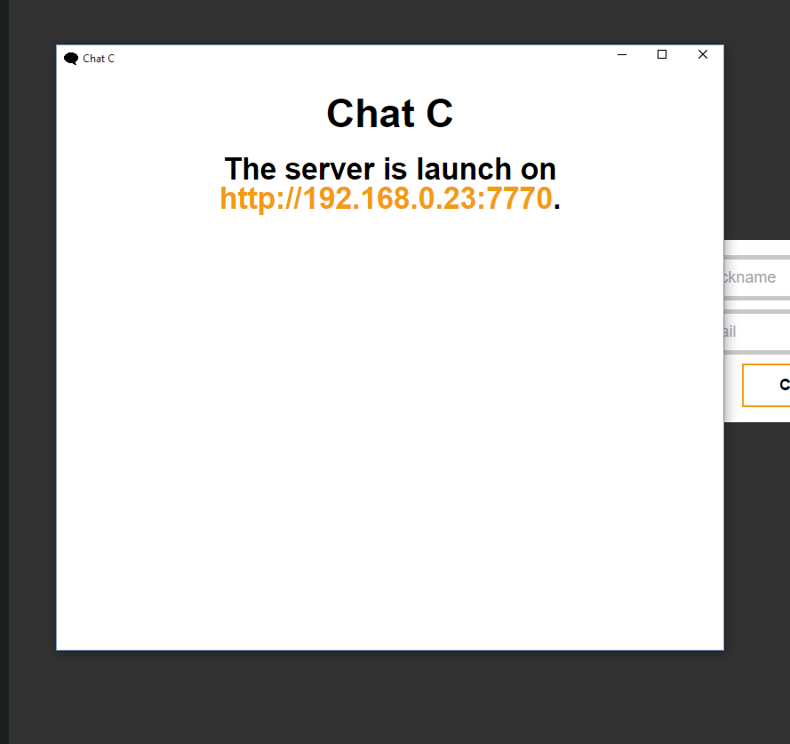

# Chat C for Desktop

[](https://travis-ci.org/cedced19/chatc-desktop)

Just a simple software for chat!
This application will run a server. 

## Installation

1. [Download for Windows](https://raw.githubusercontent.com/cedced19/ChatC/master/dist/Windows.zip)
2. Extract
3. Execute `ChatC.exe`



## To compile

```
npm install
gulp
```